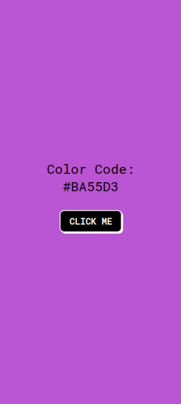
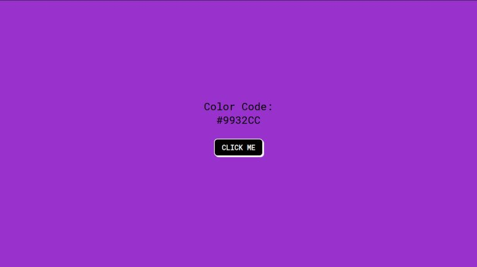
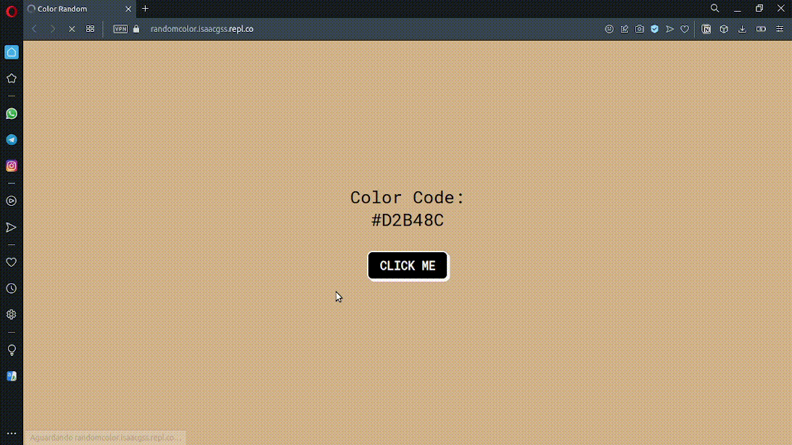

# 🌈 RandomColor
<q>Neste novo projeto eu crio uma interface que possui um único botão, e quando pressiono o fundo ele muda aleatoriamente usando <code>JS</code></q>
## 📜 Status
> Status: Finished

## 👨‍💻 Technology

> 
>  
>      
>---
>> ### JS :
>>
>> * <code><a href="https://developer.mozilla.org/pt-BR/docs/Web/JavaScript/Reference/Global_Objects/Array" target="_blank">arrays</a></code>
>> * <code><a href="https://developer.mozilla.org/en-US/docs/Web/API/Document/getElementById" target="_blank">document.getElementById()</a></code>
>> * <code><a href="https://www.w3schools.com/jsref/prop_style_backgroundcolor.asp" target="_blank">document.body.style.backgroundColor</a></code>
>> * <code><a href="https://developer.mozilla.org/pt-BR/docs/Web/JavaScript/Reference/Global_Objects/Math/floor" target="_blank">Math.floor()</a></code>
>> * <code><a href="https://developer.mozilla.org/pt-BR/docs/Web/JavaScript/Reference/Global_Objects/Math/random" target="_blank">Math.random()</a></code>
>> * <code><a href="https://developer.mozilla.org/pt-BR/docs/Web/JavaScript/Reference/Global_Objects/Array/length" target="_blank">array.length</a></code>

> Font do projeto: 
> <a href="https://www.freecodecamp.org/portuguese/news/40-projetos-em-javascript-para-iniciantes-ideias-simples-para-comecar-a-programar-em-js/#como-criar-um-trocador-de-cores" target="_blank">40 projetos em JS para iniciantes.</a>

## 💻 Funcionalidades

> * <code>background</code> Muda de cor de fororma Random 🔀;
> * Fundo é atualizado com cores🌈 Random ;
> * Rensponsividade 📱;

## 👀 Preview

> 
> 
> 
> ### Gif
> 
